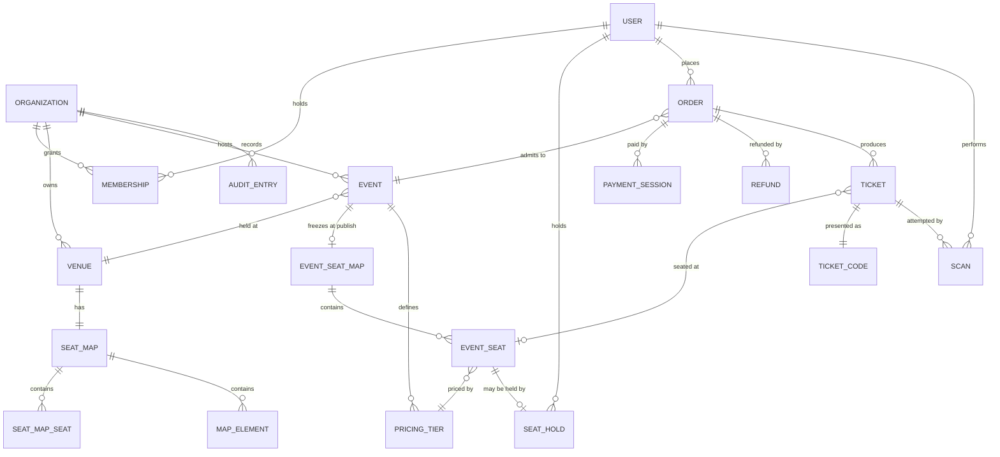

# Domain Model

The conceptual model: entities, how they relate, and the rules that must always hold.
Terms are defined in [CONTEXT.md](../CONTEXT.md) and are not redefined here.

This is not a database schema. Tables, columns, indexes and migrations live in the backend
repository and are an implementation of this model.

## Entities and relationships

### Notes on the shape

**`SEAT_MAP_SEAT` and `EVENT_SEAT` are separate on purpose.** The first belongs to a Venue
and is editable forever; the second is the frozen copy taken at publish. See
[ADR-0001](../docs/adr/0001-event-seat-map-is-a-snapshot.md).

**An Event carries an admission window, not only a start time.** `doorsOpenAt` and `endsAt`
bracket when a Ticket may be redeemed. A start time alone cannot decide whether a door is open:
people arrive before an event begins and leave after it ends, and the refusals in
[007](../requirements/007-admission-scanning.md) have nothing to measure against without it.

**An Event's cover image is not part of what publishing freezes.** The Seat Map is copied and
fixed at publish ([ADR-0001](../docs/adr/0001-event-seat-map-is-a-snapshot.md)) because a
sold Ticket depends on it; a picture is not something anybody bought. So a cover stays
editable for as long as the Event is, and changing it changes what buyers see - which is the
useful behaviour, since the reason to change a poster is usually that the old one was wrong.

**A Seat carries both a label and coordinates.** The label (`H-14`) is what is printed on a
Ticket and shouted across a room. The coordinates are what let a buyer recognise where they
will sit. Neither substitutes for the other.

**A Pricing Tier's name is assigned on the Venue's Seat Map; its price is set on the Event.**
The front rows are the front rows every night, but what they cost is a decision per show.

**A Venue's city is a field in its own right**, not a line inside a free-text address, because
the public listing filters on it.

**`MAP_ELEMENT` is non-sellable** — a stage, an entrance, an aisle, a bar. It exists so a
buyer can orient themselves. It is never ticketed.

**A Ticket's seat is optional.** General admission is not built in v1, but modelling the
relationship as optional costs nothing now and avoids a migration if it is ever added.

**A Venue has exactly one Seat Map.** A known simplification: real venues have several
configurations (seated, standing, banquet). Revisit when a second configuration is needed.

## Invariants

These must hold at all times. Where the database can enforce one, it should.

### Tenancy

1. Every record belongs to exactly one Organization, and no query may return rows from
   another. Enforced by Postgres row-level security, not by application predicates
   ([ADR-0004](../docs/adr/0004-row-level-security-for-tenant-isolation.md)).
2. A User may hold at most one Membership per Organization.
3. Gate Staff may read only what is needed to scan. Sales figures and revenue are never
   visible to them.

### Seats and holds

4. A Seat Hold and a Ticket may not exist for the same Event Seat at the same time.
5. At most one active Seat Hold may exist per Event Seat, and the database is what makes
   that true — not a check in application code. At 500 concurrent buyers the race is the
   normal case rather than the exception, and a read followed by a write loses it. Whether
   the guarantee is a constraint, a row lock or a structure in which a second hold cannot be
   represented is an implementation decision; that it is never application logic is not.
6. A Seat Hold may only be created for a User whose email is verified. Verification never
   happens inside a checkout, because the hold's clock would race the email round-trip.
7. A Seat Hold expires automatically. Expiry releases the Event Seat with no trace on the
   buyer's Order.

### Publishing

8. An Event in Draft tracks its Venue's Seat Map. Publishing copies it into an Event Seat
   Map, which is immutable from that moment.
9. After publish, the Venue and the Event Seat Map cannot change. Title, description and
   images may. Start time may, but every ticket holder must be notified.
10. A price change applies only to sales made afterwards. It never applies retroactively,
    and never to an existing Seat Hold.
11. Capacity may grow but never shrink below the number of Tickets already sold.
12. The governing rule, from which 8–11 follow: **nothing a sold Ticket depends on may
    change under it.**

### Tickets and admission

13. One Ticket admits one person once. A Ticket is redeemed by exactly one Scan.
14. Every Scan is recorded, including refused ones, with the scanning User, the device and
    the instant.
15. A Ticket has exactly one Ticket Code, and only that code is accepted. There is no way to
    replace it in v1: a code that leaks is dealt with by voiding the Ticket and refunding it,
    which is a blunter instrument than reissuing and the only one v1 has.
16. A Ticket Code is meaningless on its own: it identifies a Ticket and carries no other
    information. Seat, event and validity are resolved server-side at scan time.
17. Authorisation to scan is checked against live Membership at scan time, not against
    claims in an access token
    ([ADR-0005](../docs/adr/0005-jwt-with-revocable-refresh-tokens.md)).

### Money

18. An Order has at most one successful Payment Session. It may have many attempts.
19. Payment is confirmed by the provider's webhook, never by the buyer returning to the
    site. Confirmation is idempotent
    ([ADR-0002](../docs/adr/0002-payment-session-abstraction.md)).
20. Tickets are issued only after an Order's payment is confirmed.
21. A redeemed Ticket can never be refunded.
22. Cancelling an Event voids every Ticket and refunds every paid Order, tracked per Order
    because it will partially fail.

### Audit

23. Publishing, price changes, refunds, event cancellation and Membership changes are
    recorded with actor and instant, append-only.
